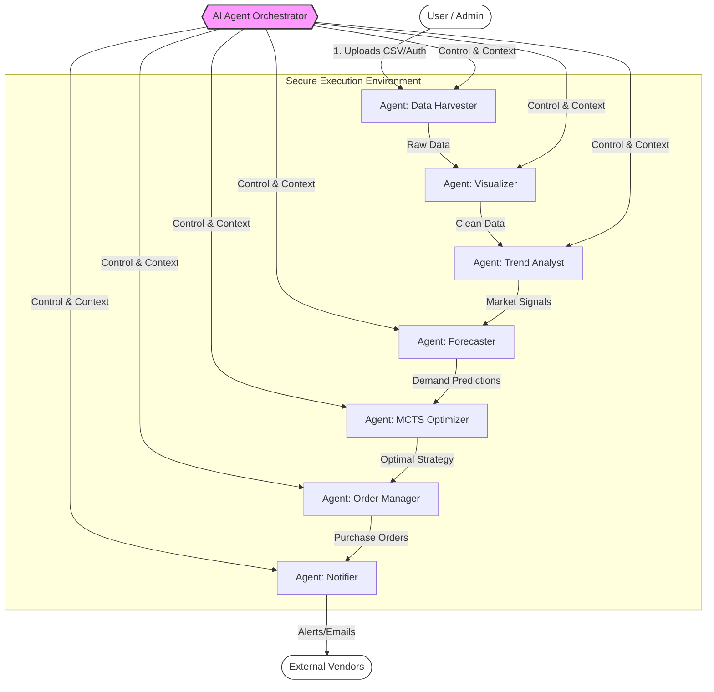

# AURAChain AI-Native Multi-Agent Business Intelligence Platform

AURAChain is a production-grade platform designed to democratize advanced business intelligence for MSMEs. It leverages a sophisticated multi-agent architecture to autonomously ingest data, analyze trends, forecast demand, and optimize supply chain decisions through a unified chat interface.

---

## 🔗 Live Demo (Vercel)

Experience the live platform here:  
👉 **https://aurachainai.vercel.app/**

---

## 📂 Demo Dataset

To quickly test the platform, use the sample dataset:

👉 **[Download synthetic_supply_chain_data.csv](./demo/synthetic_supply_chain_data.csv)**  
(Upload this file in the chat interface to see full analysis.)

---

## System Architecture

The platform is built on a "Hub and Spoke" model where a central AI Orchestrator manages specialized agents within a secure environment.

### Architecture Diagram (Mermaid.js)



---

## Core Features

* **Multi-Agent Orchestration**: A central orchestrator (Claude 4.5 Sonnet) intelligently routes tasks to specialized agents based on user intent.
* **Model Agnostic Core**: Integrates Anthropic Claude, Google Gemini 1.5/2.0, and OpenAI GPT-4o.
* **Full Observability**: OpenTelemetry + Prometheus/Grafana instrumentation.
* **Interactive Workflow UI**: React-based visualization of the agent execution plan and artifacts.
* **Advanced Optimization**: Monte Carlo Tree Search (MCTS) engine for inventory and decision optimization.

---

## The Agent Ecosystem

| Agent              | Model             | Role & Capability                                                       |
| ------------------ | ----------------- | ----------------------------------------------------------------------- |
| **Orchestrator**   | Claude 4.5 Sonnet | Interprets intent, orchestrates agents, manages dependency graph.       |
| **Data Harvester** | Gemini 1.5 Flash  | Ingests, cleans, validates structured business datasets.                |
| **Trend Analyst**  | Gemini 2.0 Flash  | Performs statistical trend analysis & fetches external market signals.  |
| **Forecaster**     | Claude 3.5 Sonnet | Time-series forecasting with Prophet and seasonality modeling.          |
| **MCTS Optimizer** | Claude 3.5 Sonnet | Simulates thousands of inventory scenarios to compute optimal policies. |
| **Visualizer**     | Claude 3.5 Sonnet | Produces dynamic Plotly charts and visual artifacts.                    |
| **Order Manager**  | GPT-4o            | Generates purchase orders, handles approval workflows.                  |
| **Notifier**       | GPT-4o-mini       | Sends alerts via Email/Discord.                                         |

---

## Technology Stack

* **Backend**: Python 3.11, FastAPI, SQLAlchemy, Pydantic V2
* **Frontend**: React 19, TypeScript, Vite, Tailwind CSS, Zustand
* **Data & Memory**: PostgreSQL, Redis
* **Infrastructure**: Docker Compose, OpenTelemetry

---

## Getting Started

### Prerequisites

* Docker & Docker Compose
* API Keys for Anthropic, Google Gemini, and OpenAI

### Installation

```bash
git clone https://github.com/your-org/aurachain.git
cd aurachain
```

### Configure Environment

```bash
cp aura_chain/.env.example aura_chain/.env
```

Update `.env` with your API keys.

### Launch Services

```bash
cd aura_chain
docker-compose up -d
```

### Access the Platform

* **Web UI**: [http://localhost:5173](http://localhost:5173)
* **API Docs**: [http://localhost:8000/docs](http://localhost:8000/docs)
* **Grafana**: [http://localhost:3000](http://localhost:3000) (admin/admin)

---

## Usage Guide

### 1. Data Ingestion

Upload structured files (CSV, XLSX, JSON) using the chat attachment icon.

### 2. Running Analysis

Use natural language:

* *"Analyze sales trends for Gaming Laptops last year."*
* *"Forecast Q3 demand considering Indian holidays."*
* *"Optimize inventory to reduce holding cost and bullwhip effect."*

### 3. Interpreting Results

* **Agent Plan** visualization shows the orchestrator’s execution graph.
* **Artifacts** include reports, charts, simulations, and forecast outputs.

---

## Project Structure

```
├── aura_chain/             # Backend (FastAPI)
│   ├── app/
│   │   ├── agents/         # Agent definitions (MCTS, Prophet, etc.)
│   │   ├── api/            # API routes
│   │   ├── core/           # Config, Memory, Observability
│   │   └── tools/          # MCP Tools & processing
│   ├── tests/              # Pytest suite
│   └── Dockerfile
├── aurachain-ui/           # Frontend (React)
│   ├── src/
│   │   ├── components/     # Chat, Canvas UI
│   │   ├── store/          # Zustand state
│   │   └── services/       # API integration
│   └── Dockerfile
└── docker-compose.yml      # Orchestration config
```

---

## Local Development (Without Docker)

### Backend

```bash
cd aura_chain
python -m venv venv
source venv/bin/activate
pip install -r requirements.txt
python scripts/setup_db.py
uvicorn app.main:app --reload
```

### Frontend

```bash
cd aurachain-ui
npm install
npm run dev
```

---

## License

MIT License. See `LICENSE` for details.